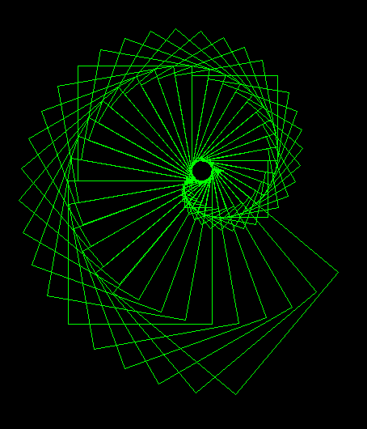
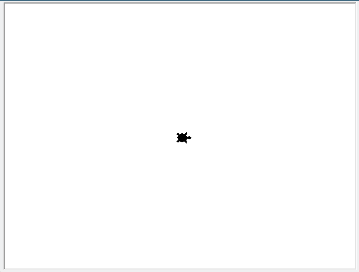
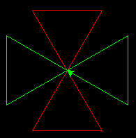
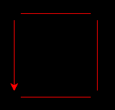
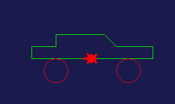

# Κεφάλαιο 4: Παίζοντας με τη χελώνα

{: .image}

Φανταστείτε μια χελώνα με μπογιά στην ουρά της, που να περιμένει να της δώσουμε εντολές για το πως να κινηθεί. Καθώς θα περπατάει αυτή η χελώνα, θα αφήνει ίχνη από πίσω της, με αποτέλεσμα να μπορούμε να κάνουμε σχέδια δίνοντας εντολές στη χελώνα μας.

Στην Python υπάρχει μια τέτοια χελώνα (turtle) και σε αυτό το κεφάλαιο θα δούμε πως θα την καλέσουμε και με τη βοήθειά της θα κάνουμε κάποια βασικά σχέδια.

## 4.1 Καλώντας ένα module

Στην Python, όπως και σε πολλές άλλες γλώσσες προγραμματισμού, κάποιες ειδικές λειτουργίες δεν συμπεριλαμβάνονται στη βασική λειτουργία (πυρήνα) της γλώσσας, αλλά βρίσκονται σε ξεχωριστές βιβλιοθήκες ή αρχεία. Στην Python αυτά τα πακέτα που περιγράφουν συγκεκριμένες λειτουργίες, ονομάζονται modules.

Αν δεν συνέβαινε αυτό, η γλώσσα θα ήταν τεράστια και πιθανόν να μη χωρούσε στον υπολογιστή μας. Για την Python υπάρχουν αμέτρητα modules που την κάνουν χρήσιμη σε διάφορες επιστήμες, στην ανάπτυξη παιχνιδιών και πολλούς άλλους τομείς. 

Για να πούμε στην Python ότι θέλουμε να χρησιμοποιήσουμε ένα module, της ζητάμε να εισάγει (import) αυτό το module στο πρόγραμμά μας. Φυσικά, υπάρχει περίπτωση να μην το έχουμε εγκαταστημένο, οπότε θα πρέπει να το εγκαταστήσουμε πρώτα.

Ένα ενδιαφέρον και διασκεδαστικό module που έρχεται με την βασική εγκατάσταση της Python, είναι το `turtle` (χελώνα). Για να το καλέσουμε και να μπορέσουμε να το χρησιμοποιήσουμε, γράφουμε στην αρχή του προγράμματός μας:

```python
import turtle
```

Τώρα, είμαστε έτοιμοι να πειραματιστούμε και να δημιουργήσουμε όμορφα σχέδια με τη χελώνα μας. Για να καλέσουμε τη χελώνα μας και να πάρουμε τον έλεγχό της αρκεί να γράψουμε:

```python
my_turtle = turtle.Pen()
```

Με την παραπάνω εντολή, ανοίγει ο καμβάς μας, η μεταβλητή `my_turtle` γίνεται η χελώνα μας και τοποθετείται στο κέντρο (εμείς θα δούμε ένα βελάκι, για να είναι πιο ξεκάθαρη η εικόνα για μας). Τώρα, περιμένει από εμάς να της δώσουμε εντολές και να σχεδιάσει.

*Σημείωση:* Αν θέλουμε να δούμε χελώνα αντί για βελάκι, μπορούμε να την καλέσουμε όπως φαίνεται παρακάτω:

```python
my_turtle = turtle.Pen(shape='turtle')
```

{: .image}

## 4.2 Τα χρώματα στην Python

Τα χρώματα μπορεί να οριστούν είτε με το όνομά τους `'green', 'red', 'yellow', 'blue', 'black', ...` ή με την χρήση του συνδυασμού των βασικών χρωμάτων, που στον υπολογιστή είναι **κόκκινο, πράσινο, μπλε (RGB)**. Αν θέλουμε να ορίσουμε ένα χρώμα, λοιπόν, έχουμε τις παρακάτω επολογές:

```python
# Color by name
color_red = 'red'
color_green = 'green'
color_blue = 'blue'
color_yellow = 'yellow'
# ...

# Colors using R,G,B
rgb_red = (1, 0, 0)
rgb_green = (0, 1, 0)
rgb_blue = (0, 0, 1)
rgb_yellow = (1, 1, 0)
``` 

Οι τιμές στην περίπτωση του ορισμού του χρώματος με RGB, είναι ανάμεσα σε 0 και 1. Οπότε, αν θέλουμε στο κίτρινο, να βάλουμε και λίγο μπλε μπορούμε να δοκιμάσουμε: `c = (1, 1, 0.12)`.

Για να αλλάξουμε το φόντο του καμβά μας, δεν δίνουμε εντολές στη χελώνα, αλλά στο ίδιο το module που χρησιμοποιούμε. Έτσι, για να ορίσουμε το χρώμα του φόντου λέμε:

```python
c = 'green'
turtle.bgcolor(c)

# OR
# turtle.bgcolor('green')
```

Πειραματιστείτε με διάφορα χρώματα του καμβά!

## 4.3 Οι βασικές εντολές της χελώνας

Έστω ότι ορίσαμε τον καμβά και τη χελώνα μας με τις εντολές:

```python
import turtle

# Background color
turtle.bgcolor((0.3, 0.3, 0.6))

t = turtle.Pen(shape = 'turtle')
```

Τώρα, έχουμε μια χελώνα σε ένα σκούρο φόντο να περιμένει να της δώσουμε εντολές ώστε να σχεδιάσει. Παρατηρήστε ότι η χελώνα μας είναι η μεταβλητή `t`, οπότε οι εντολές που θα δώσουμε θα είναι σε αυτή την μεταβλητή.

Στον παρακάτω πίνακα εμφανίζονται οι βασικές εντολές που καταλαβαίνει η χελώνα και που θα μας βοηθήσουν να κάνουμε τα σχέδιά μας:

| Εντολή              | Παράδειγμα            | Περιγραφή                                   |
| ------------------- | --------------------- | ------------------------------------------- |
| `t.forward(steps)`  | `t.forward(100)`      | Προχώρα steps (100) βήματα μπροστά.         |
| `t.backward(steps)` | `t.backward(100)`     | Προχώρα steps (100) βήματα πίσω.            |
| `t.left(angle)`     | `t.left(90)`          | Στρίψε angle (90) μοίρες αριστερά.          |
| `t.right(angle)`    | `t.right(90)`         | Στρίψε angle (90) μοίρες δεξιά.             |
| `t.goto(x, y)`      | `t.goto(0, 100)`      | Πήγαινε στη θέση x, y (0, 100).             |
| `t.reset()`         | `t.reset()`           | Πήγαινε στη αρχική κατάσταση (θέση, χρώμα). |
| `t.clear()`         | `t.clear()`           | Καθάρισε τον καμβά.                         |
| `t.pendown()`       | `t.pendown()`         | Ακούμπα τον καμβά (ζωγραφίζει).             |
| `t.penup()`         | `t.penup()`           | Μην ακουμπάς τον καμβά (δεν ζωγραφίζει).    |
| `t.color(c)`        | `t.color('green')`    | Όρισε το χρώμα της γραμμής σε c (πράσινο).  |
| `t.circle(r)`       | `t.circle(10)`        | Ζωγράφισε έναν κύκλο με ακτίνα r (10).      |

Για να δούμε ένα παράδειγμα:

```python
import turtle

turtle.bgcolor('black')

t = turtle.Pen()
t.color('red')

# Red part
t.forward(100)
t.left(120)
t.forward(200)
t.right(120)
t.forward(100)
t.right(120)
t.forward(200)

# Go to Center (50, 86.6)
t.penup()
t.goto(50, 86.6)
t.pendown()
t.color('green')

# Green part
t.right(90)
t.forward(100)
t.left(120)
t.forward(100)
t.left(120)
t.forward(200)
t.right(120)
t.forward(100)
t.right(120)
t.forward(100)
```

Το αποτέλεσμα θα είναι κάπως έτσι:



## 4.4 Ασκήσεις

Σχεδιάστε με τη βοήθεια της χελώνας, τα παρακάτω σχήματα.



